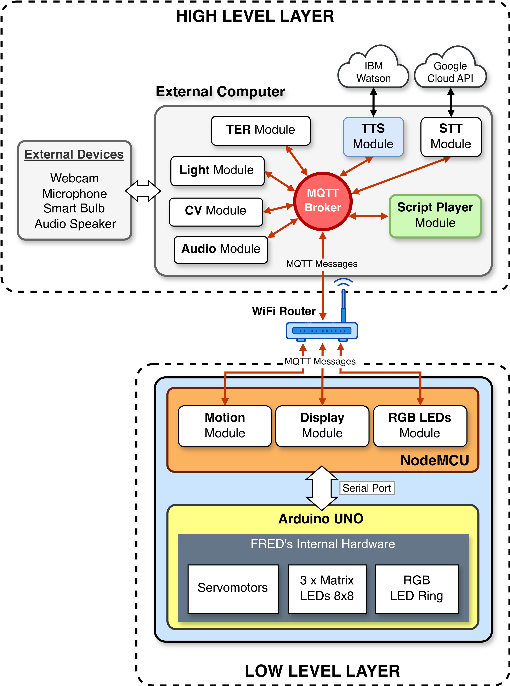
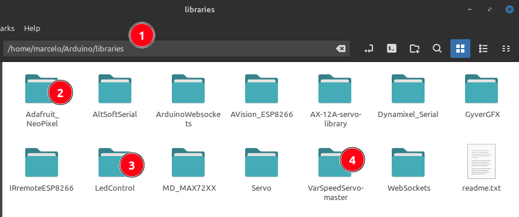
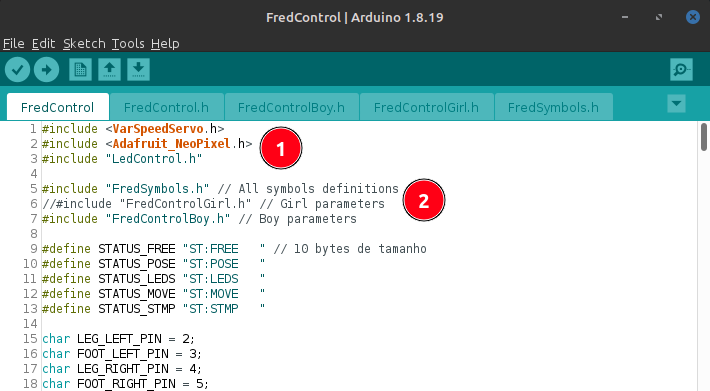

# FRED - Friendly Robot for EDucation and Healthcare
## FRED's Arduino Control Software

The software architecture of the FRED robot can be divided into two layers, high-level and low-level. The low-level layer is implemented on the Arduino UNO and ESP8266 (NodeMCU) boards inside the robot. The control software for this layer is divided into these two boards. The software running on the Arduino board is responsible for controlling and communicating with the robot's actuators, such as: the three LED arrays that represent the robot's facial expression, the RGB LED strip on the robot's chest, and the four servomotors that make up FRED's legs and feet.

 

   
<strong>Figure 1.</strong> FRED Robot - Software Archtecture (LAYERS).
   

The FRED firmware for the Arduino board depends on two libraries, **VarSpeedServo (4)**, **LedControl (3)** and **Adafruit_NeoPixel (2)**. They are, respectively, the libraries that control the servomotors and the LED ring on the robot's chest. These libraries must be inside the **libraries folder (1)** of the Arduino IDE. These libraries are available in this directory in a compressed form. You must download the three compressed files and unzip them in the IDE's **libraries folder (1)**, as you can see in Figure 2.

 

   
<strong>Figure 2.</strong> Copying and uncompressing the libraries do the Arduino libraries folder.

  
After that, the **FredControl.ino** file can be loaded into the Arduino IDE, compiled and uploaded to the Arduino UNO board.

As you can see in Figure 3, the necessary libraries are included right at the beginning of the code (1). In (2) there is the inclusion of the files **FredSymbols.h**, which contain the **array of bits** that define the design of FRED's gaze, and the files **FredControlBoy.h** and **FredControlGirl.h**, which contain some adjustments to specific parameters of the FRED and Frida robots.

 

   
<strong>Figure 3.</strong> Files used in Arduino's #include section.
