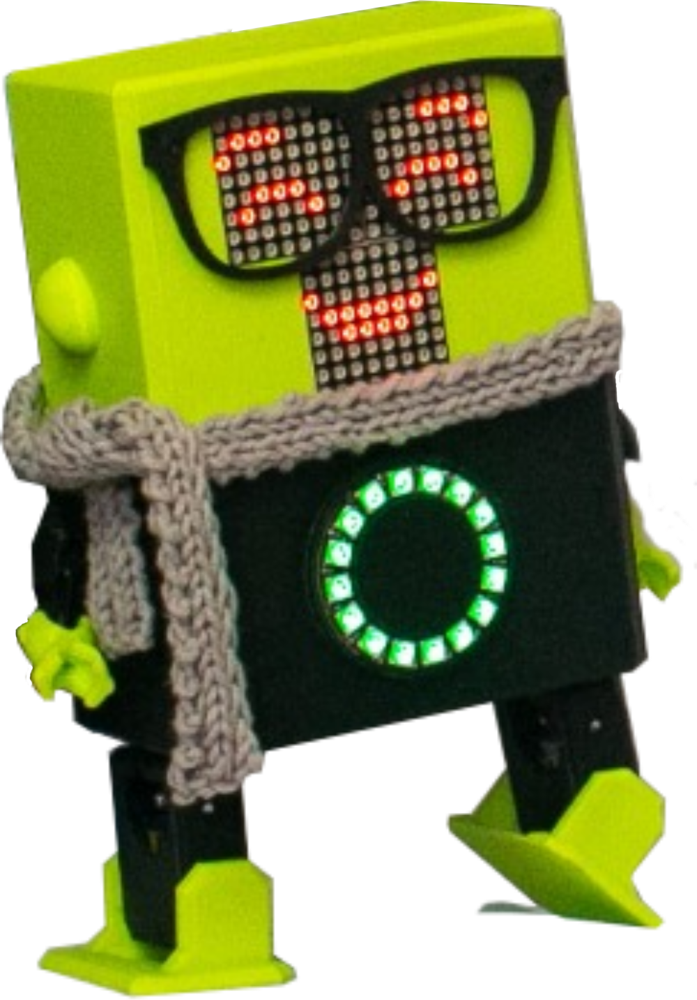

<p align="center">
  
</p>

<h1 align="center">🤖 FRED Robot: Affective Expressions Evaluation</h1>

<p align="center">
  Video stimuli used in the experimental evaluation of the interaction between <b>FRED</b> and <b>Frida</b>.
</p>

<p align="center">
  <i>Low-cost affective social robot for HRI research</i>
</p>

---

> **Note:** GitHub opens links in the same tab by default. Use **Ctrl + Click** or **Cmd + Click** to open videos in a new tab.

## 📺 Video Stimuli

| Content | Access |
| :--- | :--- |
| 🎬 **Complete Interaction Video** | [](https://drive.google.com/file/d/1tk_2WFVhhP3xDq6l1nkbsxyR0AZWvsKk/view?usp=sharing) |
| 🧩 **Video Block 1** | [](https://drive.google.com/file/d/1q6lNKHwRj1jx2exzHK6leT7QayY82fA_/view?usp=sharing) |
| 🧩 **Video Block 2** | [](https://drive.google.com/file/d/1yeiikX6_WK3IEWt2wZlTQBnLXKyv6R4-/view?usp=sharing) |
| 🧩 **Video Block 3** | [](https://drive.google.com/file/d/1kJucT7g66etR7L17el2kjXuojDAg4b3L/view?usp=sharing) |
| 🧩 **Video Block 4** | [](https://drive.google.com/file/d/1OveKEnLAxhkBeYY3cfjcOM4TK0wYmNGx/view?usp=sharing) |
| 🧩 **Video Block 5** | [](https://drive.google.com/file/d/1Opa8ckXP-JGu9QBbimEk2YqrqhGBu6S5/view?usp=sharing) |
| 🧩 **Video Block 6** | [](https://drive.google.com/file/d/1wKvsE703i596QsBOJg96iKeFG27jNnP2/view?usp=sharing) |

---

## 🧠 Description of the Stimuli

The complete video presents a dialogue between the robots **FRED** and **Frida**. For evaluation purposes, the interaction was segmented into six blocks, each containing one or more affective expressions performed by the FRED robot.

These expressions were generated through the combination of nonverbal communication elements, including facial expressions, body poses, and RGB LED patterns, representing the emotions evaluated in the study: **happiness, sadness, anger, and surprise**, as well as neutral states.

Each video block was used as an independent stimulus during the experiment, allowing participants to assess the perceived intensity of each emotion.

---

## 🔗 Citation

If you use this material, please cite:

```bibtex
@phdthesis{your_reference_here,
  author = {Your Name},
  title = {Your Thesis Title},
  school = {Your Institution},
  year = {2026}
}